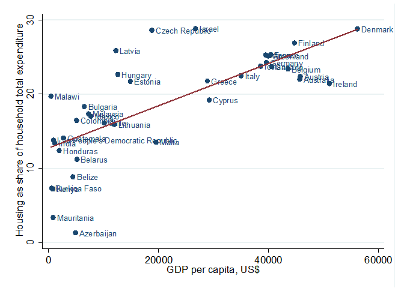
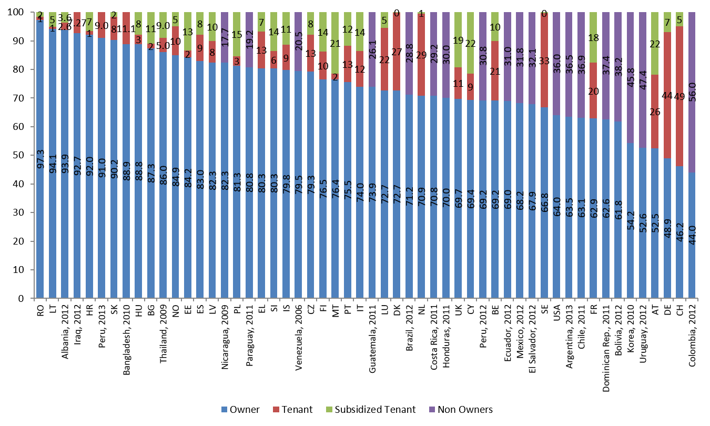
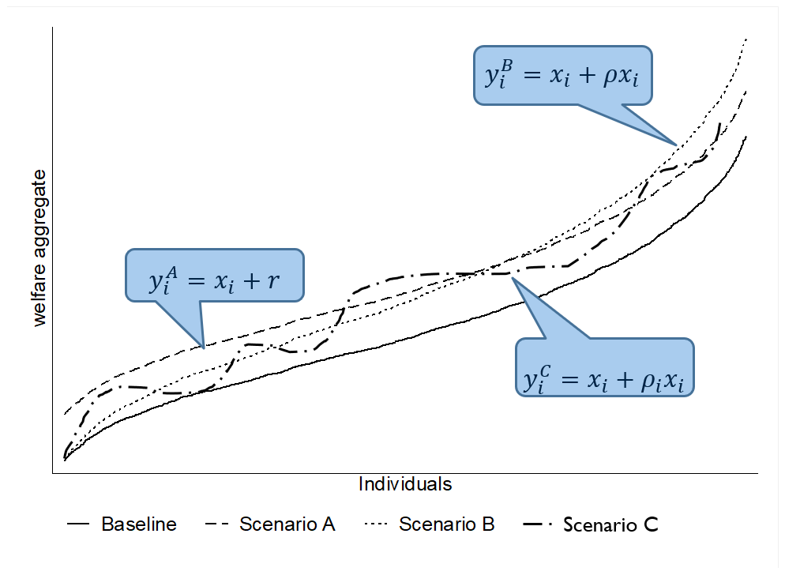

```{r setup, include=FALSE}
options(htmltools.dir.version = FALSE)
```

```{r xaringan-themer, include = FALSE}
library(xaringanthemer)
#mono_light(base_color = "#00ADE4")
mono_light()
```

# Outline

- Key References

- WHy is housing relevant?

- 


---
layout: true

# Key References

---

Deaton, A., and S. Zaidi. 2002. "Guidelines for constructing consumption aggregates for welfare analysis." _LSMS Working Paper_ No. 135, 

Balcázar, C. F., Ceriani, L. , Olivieri, S. and Ranzani, M. (2017), Rent‐Imputation for Welfare Measurement: A Review of Methodologies and Empirical Findings. _Review of Income and Wealth_, 63: 881-898. doi:10.1111/roiw.12312

---

Deaton, A., and S. Zaidi. 2002. "Guidelines for constructing consumption aggregates for welfare analysis." _LSMS Working Paper_ No. 135, 

.red[Balcázar, C. F., Ceriani, L. , Olivieri, S. and Ranzani, M. (2017), Rent‐Imputation for Welfare Measurement: A Review of Methodologies and Empirical Findings. _Review of Income and Wealth_, 63: 881-898. doi:10.1111/roiw.12312]

---
layout: false

# Why is housing relevant?

.pull-left[
### Dominant component of total income

]

.pull-right[
### Share of housing consumption increases with welfare levels 

]

---
## The essence of the problem

### In theory
- The utility is the value of the _flow of services_ from occupying the dwelling rather than the expenditure for purchase it over the period of analysis

- If rental markets worked perfectly and all households rent their dwellings, the value of the _flow of services_ is easily approximated by the value of the rent they pay. 

--

### However…
- Many households own their dwellings, So they also implicitly receive a _flow of services_ that is equivalent to value of the utility that owning the property represents for them. 

- In other cases, households receive housing free of charge or at subsidized rates by their employer, friends, relatives, government or other entities (non-market tenants). 

---
# Few housholds rent their dwelling


---
## Theoretical justification for imputing rents

- Welfare measure (i.e., expenditure) must be consistent accross households in order to make comparisons among themselves

- Including the _expenditure_ in rent by tenants and not the _flow of service_ received by owners overestimate the welfare of tenants. 

???
Imagine two identical households with the same consumption pattern. 

---
layout: true

## Different approaches to imput housing flow of service (i.e., imputing rent)

---
### Self-assessment
Use the value reported by owners and non-market tenants when they answer "if you rented this dwelling, how much would you pay per month?"

---

### Econometric and statistical methods

1. Find the best model for rents paid by tenants on the basis of observable dwelling characteristics

2. Apply the same model to home owners and non-market tenants

---
### Capital market approach
- you could either;

  - **Rent-to-value**: Find the capitalization rate from rents and market value of the dwelling; _or_, 

--
  - **User cost**: Collect information on the return rate for housing and operating costs
  
- then, apply the capitalization rate to the value of the owners occupied dwelling

---

### Payment approach

- use information about the out-ot-pocket expenditure faced by households. **For owners** it would be the mortgage, interest payments, taxes, insurance, maintenance and repairs. 
  
---
### External sources

- Other household surveys, adminustrative register, newspaper or internet offer notices, multiple listing datasets, motgage transctions, key informat evaluations. 

---

layout: false
## Different approaches to imput housing flow of service (i.e., imputing rent)

.blue[

### Self-assessment
- Use the value reported by owners and non-market tenants when they answer "if you rented this dwelling, how much would you pay per month?"
]

.blue[
### Econometric and statistical methods
1. Find the best model for rents paid by tenants on the basis of observable dwelling characteristics
2. Apply the same model to home owners and non-market tenants
]

---
## Self-assessment
- This approach is based on data collected about owners’ estimates of a fictitious market rent.

- Homeowners are asked to estimate how much they would pay if they were renting their home

- Assumption: owners can estimate rental equivalences 
  - This should be less problematic in regions where rental market is active and well developed (Lanjouw, 2009)
  - But, owner-occupiers may over-estimate the true rental value of their dwelling given the affinity to their property or neighborhood (owner pride factor)

- Should be treated with caution and should be tested

---
## Econometric models

- Hedonic model
  - Theory and generi form
  - Semi-log
  - Heckman Selection

- Stratification
---
layout: true
## Hedonic models - Theory

---
- Utility derives from attributes or characteristics of goods and not from goods per se (Lancaster, 1966) 

--

- In equilibrium, economic agents observe the prices of differentiated products and specific amounts of characteristics associated with them. This reveals the _implicit prices for the different characteristics_ (Rosen, 1974)

---
Housing can be considered as a composite commodity:

$$R_h = R(\mathbf{L}_h, \mathbf{S}_h, \mathbf{N}_h) = \mathbf{R}(\mathbf{X}_h)$$

where, 
- $\mathbf{L}_h$, Location of dwelling
- $\mathbf{S}_h$, Structural Characteristics
- $\mathbf{N}_h$, Neighborhood


--
However, 
- No consensus about the specific explicit form the hedonic price function might take
- The relation between rent and characteristics should be non-linear

???
Chars: home or apartment, type of construction, age of the building, dimensions and number of rooms
Neighborhood: quality of school, accessibility to public transport, proximity of streets,
crime rates, poverty rate, traffic congestion, etc.

---
- If we have $X_m$ observable attributes for a dwelling, with $m=1,2,...,M$, the most generic functional specification is, 

--
$$g(R_h) = \alpha_0 + \sum_{m=1}^{M}f_m(X_{hm})\beta_{hm}+
\sum_{m=1}^{M}\sum_{k=1}^{M}f_m(X_{hm})f_k(X_{kh})\gamma_{hmk} + \epsilon_h$$

--
.pull-left[

]

--
.pull-right[

]


???
where 𝑔𝑔(∙) can be either the identity function or the natural logarithm; 𝑓𝑓𝑗𝑗(∙), 𝑗𝑗 = 𝑚𝑚, 𝑘𝑘, could be (i) the
identity function, (ii) an indicator function taking value 1 if the dwelling has the characteristic and 0
otherwise, (iii) some high level polynomial, or (iv) a Box-Cox transformation, and 𝜀𝜀ℎ represents the
unobservables. At one extreme where no dwelling characteristic is observed and 𝑔𝑔(∙) is the identity
function, the constant parameter 𝛼𝛼0 would correspond to the average dwelling rent of the reference
population. 𝛽𝛽ℎ𝑚𝑚 and 𝛾𝛾ℎ𝑚𝑚𝑚𝑚 are the parameters associated respectively to each (transformed)
characteristic 𝑋𝑋𝑚𝑚 and each interacted (transformed) characteristics 𝑋𝑋𝑚𝑚 and 𝑋𝑋𝑘𝑘. Other parametric
functional forms can be derived as a special case of equation (2)
---
- If we have $X_m$ observable attributes for a dwelling, with $m=1,2,...,M$, the most generic functional specification is, 

$$g(R_h) = \alpha_0 + \sum_{m=1}^{M}f_m(X_{hm})\beta_{hm}+
\sum_{m=1}^{M}\sum_{k=1}^{M}f_m(X_{hm})f_k(X_{kh})\gamma_{hmk} + \varepsilon_h$$

- In the literature, different specifications and estimation methods are found:
  - Linear, semi-log and higher order
  - Quantile regression, semi-parametric and non-parametric
  - Heckman selection model
  - Spatial Dependency

???
where 𝑔𝑔(∙) can be either the identity function or the natural logarithm; 𝑓𝑓𝑗𝑗(∙), 𝑗𝑗 = 𝑚𝑚, 𝑘𝑘, could be (i) the
identity function, (ii) an indicator function taking value 1 if the dwelling has the characteristic and 0
otherwise, (iii) some high level polynomial, or (iv) a Box-Cox transformation, and 𝜀𝜀ℎ represents the
unobservables. At one extreme where no dwelling characteristic is observed and 𝑔𝑔(∙) is the identity
function, the constant parameter 𝛼𝛼0 would correspond to the average dwelling rent of the reference
population. 𝛽𝛽ℎ𝑚𝑚 and 𝛾𝛾ℎ𝑚𝑚𝑚𝑚 are the parameters associated respectively to each (transformed)
characteristic 𝑋𝑋𝑚𝑚 and each interacted (transformed) characteristics 𝑋𝑋𝑚𝑚 and 𝑋𝑋𝑘𝑘. Other parametric
functional forms can be derived as a special case of equation (2)
---
layout: false

## Hedonic models - Semi-log

$$\ln(R_h) = \alpha_0 + \sum_{m=1}^{M}f_m(X_{hm})\beta_{hm} + \varepsilon_h$$
- Pros:
  - The coefficients show approximately the percentage change in the imputed rent for a given unit-change in the covariate
  - It mitigates the heteroskedasticity problem 
  - It is computationally simple
  - It allows the marginal rent-value to be a non-linear function of the size and quality of the dwelling
- Cons:
  - The unobserved quality of the dwelling chosen by renters can be different from that chosen by owners

---

## Hedonic models - Heckman Selection
- IF the choice between owning or renting is not independent from the characteristics of the dwelling, the OLS estimators in the rental market might be inconsistent. 

- A plausible solution is to implemente a Heckman two-stages selection model,

$$g(R_h) = alpha_0 + \sum_{m=1}^{M}f_m(X_{hm})\beta_{hm} + \varepsilon_h \text{ if }t_h = 1$$
where, 

$$t_h = \begin{cases}
  1 \text{ if }  \sum_{m=1}^{M}f_m(X_{hm})\gamma_{hm} + \sum_{j=1}^{J}f_j(X_{hj})\delta_{hj} + \eta_h\\ 
  0 \text{ otherwise } 
  \end{cases}$$

- $X_{hj}$ is a vector of explanatory variables which is assumed to determine the tenure status and to be independent of the rent value. 
- Errors terms $\varepsilon_h \text{ and } \eta_h$ are jointly distributed as normal. 

---

## Hedonic models - Heckman Selection
- Pros:
  - Simple and fast to implement
  - We can apply the model fitted on tenants on the entire population and get an estimate of imputed rent for everybody

--
- Cons:
  - We risk to underestimate the prediction for those with higher flow of services from housing and to overestimate the prediction for those with lower 
  - There is no way to test whether the prediction for owners and non market tenants is accurate

--
- consider:
.blue[In some countries, housing and rental markets are not well enough developed to permit any serious estimate of rental value, and attempts to repair the deficiency using data from a small number of households are unlikely to be effective, however sophisticated the econometric technique
]  (Deaton and Zaidi, 2002, p.38-39)

---

## Stratification
- Define a set of relevant characteristics $(𝑋^𝐴, 𝑋^𝐵, 𝑋^𝐶, …)$
- Each characteristic have a set of possible realizations:
  - $X^A = \{x_1^A,x_2^A,x_3^A\}$ (e.g. Region1, Region2, Region3)
  - $X^B = \{x_1^B,x_2^B\}$ (e.g. Detached House, Flat)
  - $X^C = \{x_1^C,x_2^C,x_3^C,x_4^C\}$ (e.g. 1room, 2rooms, 3rooms, >3rooms)
  
- From which we can define strata of dwellings with homogeneous characteristics:
$$(\underbrace{x_1^A,x_1^B, x_1^C}_\text{Stratum1}),
(\underbrace{x_2^A,x_2^B, x_2^C}_\text{Stratum2}),
(\underbrace{x_3^A,x_3^B, x_3^C}_\text{Stratum3})$$
- Take the average rent for each stratum and assign it to each owner-occupied or non-market tenant dwelling in the same stratum

---
## Stratification
- Pros:
  - Dwellings in the same strata will be of a more homogeneous quality, leading to more precise estimates for owners and non-market tenants, since the model is defined on dwellings with similar characteristics 

- Cons:
  - Increasing the number of strata reduces the average number of observations per stratum
  - Owners may belong to stratas that do not exist in the rent markets

- What we learn:
  - We may obtain better predictions for owners if we infer their rents using information from tenants with dwellings having similar characteristics

---

class: inverse
# Distributional Impacts

---
## theoretical framework

- Population $N = [1, 2, ...,n]$ individuals, where $n \in \mathbb{N}$
- Distribution of welfare without rents: $x = [x_1, x_2, ..., x_n]$, 
  - $x_i$ level of welfare aggregate individual $i$.
  - Assume $x_1 \leq x_2 \leq ...\leq x_n$
- Distribution of rents: $r = [r_1, r_2, ..., r_n]$, 

--

- Three possible scenarios:

    $$\begin{align}
    A.& \quad r_i^A &= r \quad \forall i &\in N \\\\
    B.& \quad r_i^B &= \rho x_i \quad \forall i &\in N, \rho \in (0,1) \\\\
    C.& \quad r_i^C &= \rho_i x_i \quad \forall i &\in N, \rho_i \in (0,1)
    \end{align}$$

---
## theoretical framework


$$y^j \equiv x = r^j = [x_1 + r_1^j,x_2 + r_2^j, ..., x_n + r_n^j] 
\quad j \in [A, B, C]$$

$$\mu(y^j)>\mu(x)$$

---
# Distributional impact of Ren imputation
We are interested in

- Distribution
  - Shape
  - Inequality
  - Ranking
  - Shared prosperity
  
--

- Poverty
  - Levels
  - Profile
---
### Different scenarios
.pull-left[
Imagine a rent incidence curve:

$$g_q = \frac{y_q^j - x_q}{x_q}= \frac{(x+r^j)_q-x_q}{x_q} $$
```{r,  fig.align='center',  echo=FALSE}
knitr::include_graphics('./img/scenarioB.png')
```
]

.pull-right[
```{r,  fig.align='center',  echo=FALSE}
knitr::include_graphics('./img/scenarioA.png')
```
```{r,  fig.align='center', echo=FALSE}
knitr::include_graphics('./img/scenarioC.png')
```
]

---
## Evidence from the literature
- In general, the literature finds that including rents reduces inequality
- Mainly developed countries
- Mostly income as welfare aggregate
- Some examples:
  - Guenardand S. Mesple-Somps (2010) for Madagascar and Cote D’Ivoire: the poor are more likely to own their homes
  - Gasparini and Escudero (2004) for the Greater Buenos Aires area: large proportion of house-owners at the bottom of income distribution, and income elasticity in housing expenditure <1
  - Törmälehto and Sauli (2010, 2013) for 29 EU-SILC countries: combined effect of the equalizing gap-effect and dis-equalizing re-ranking effect

---
