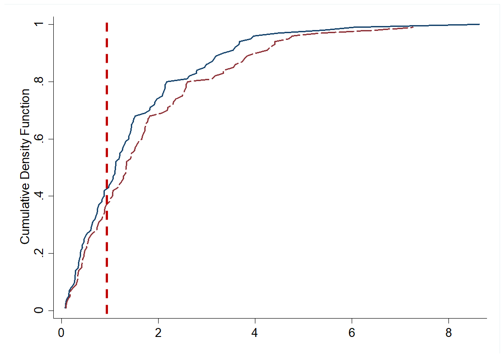
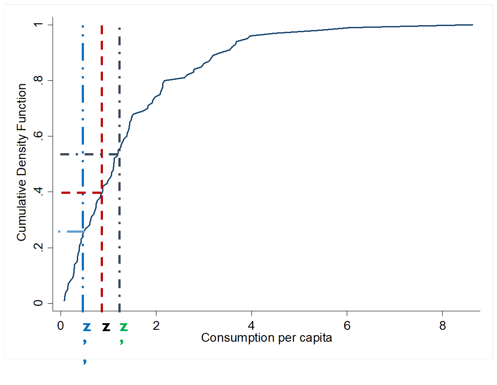
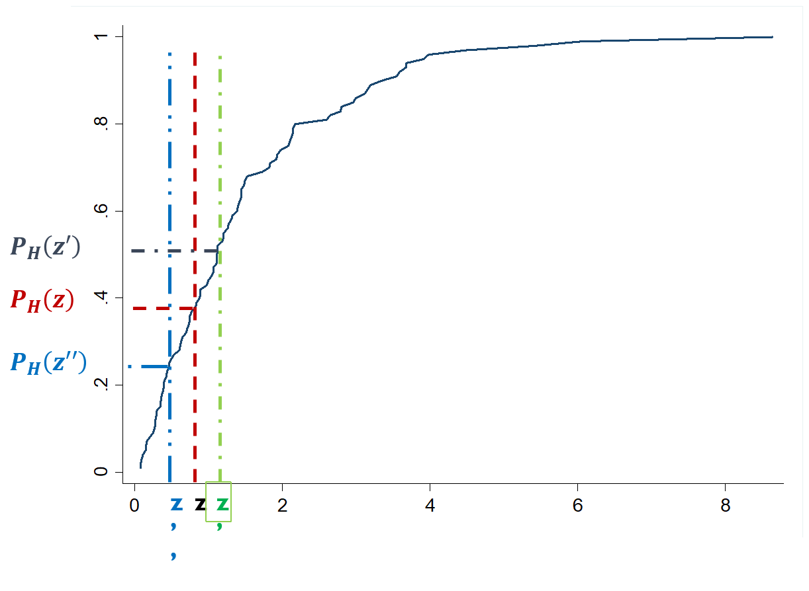
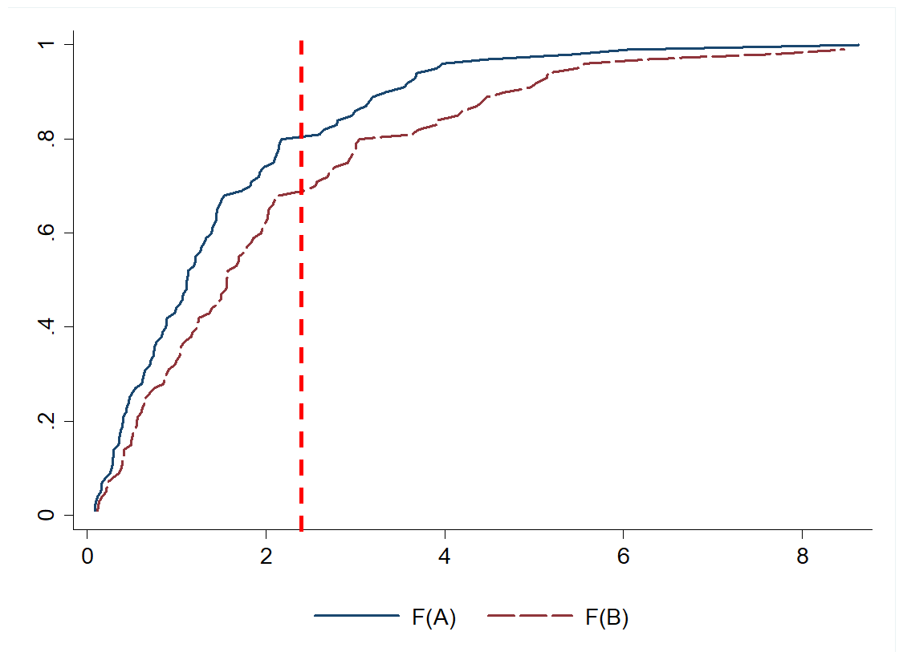
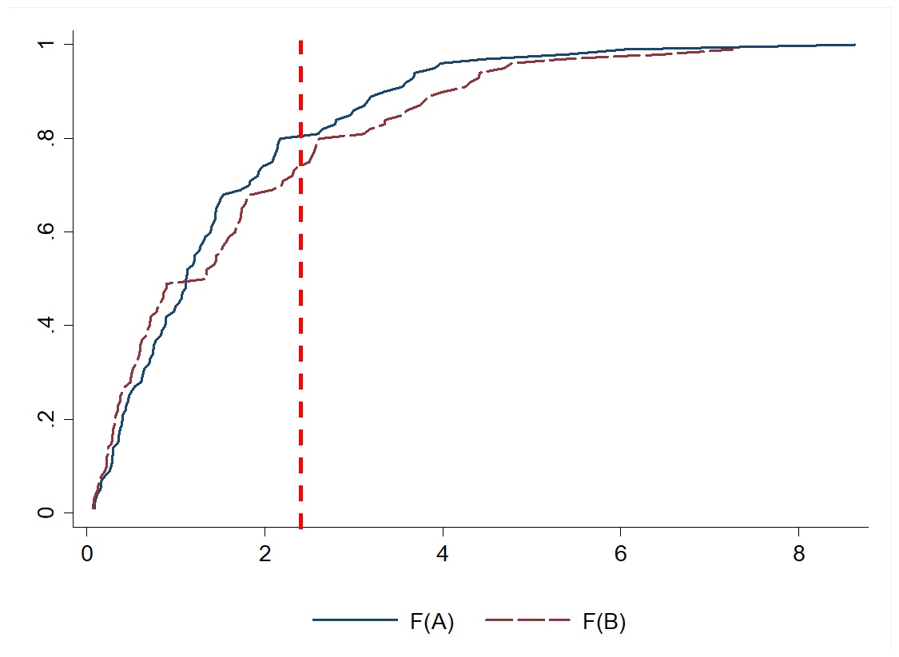
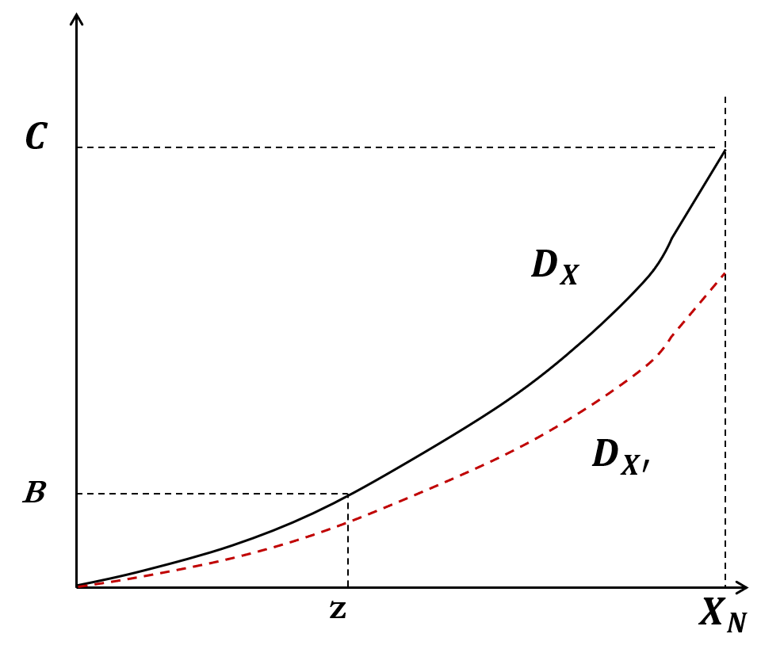
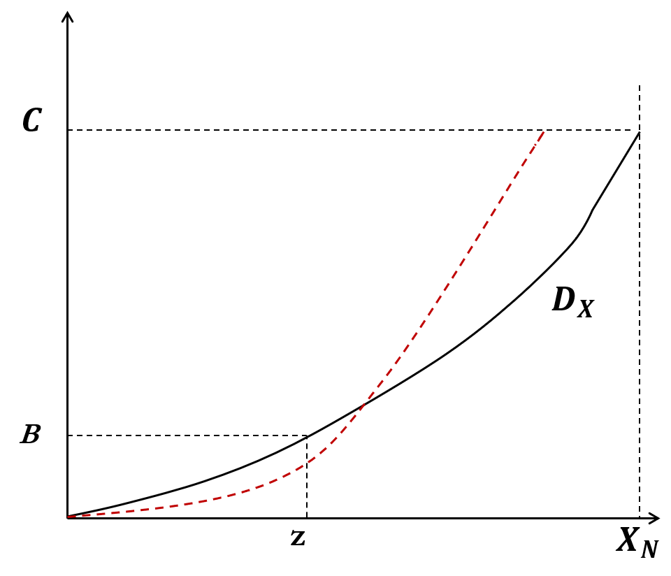
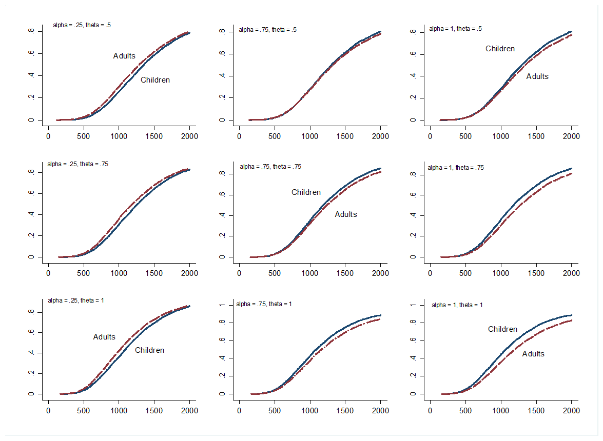

```{r setup, include=FALSE}
options(htmltools.dir.version = FALSE)
```

```{r xaringan-themer, include = FALSE}
library(xaringanthemer)
#mono_light(base_color = "#00ADE4")
mono_light()
```

# Why checking for robustness?

- What do you think are the main reasons why poverty may not be robust?

--
1. Arbitrariness of the choice of Poverty Index
2. Arbitrariness of the choice of Poverty Line
3. Equivalence of scale used
4. Sampling error

--

- What else? 

---
# Elasticity of FGT poverty measure with respect to per capita consumption

$$\eta = \frac{\Delta\%FGT_\alpha(x,z)}{\Delta\%PCE}$$
--

- Shift the distribution without changing its relative shape

- Poverty line remains constant

- What would happen if there is a concentration of marginal poor around the poverty line?

--

- .red[What are the main reasons why the consumption aggreagte may change?]

---
## Graphical representation of change in PCE
```{r pce_shift,  fig.align='left',  echo=FALSE}

```

---
## The same is true if we change the poverty lines
- Each component of the absolute poverty line (i.e. CBN) is a function of several variables that affects results
  
  - Food component
    
    - “Reference” Group could lead to different poverty lines even using the same method;
    
    - Nutritional requirement
    
    - Average or median of the “reference” population not only for quantities but also for prices
  
  - Nonfood component
    
    - How do we define the interval (“close”) to the poverty line?
    
    - Lower poverty line & upper poverty line
---
## Graphical representation of change in poverty lines
```{r pl_shift,  fig.align='left',  echo=FALSE}

```

---
# Poverty Dominance Analysis

- Dominance analysis is a comparison of multiple distributions. 

- It allows us to compare results for all poverty lines when comparing across time/subpopulations

- Three relevant poverty curves:

  - Poverty incidence curves

  - Poverty deficit curves

  - Poverty severity curves
---
## Poverty incidence curves
```{r pov_inc_curve,  fig.align='left',  echo=FALSE}

```

???
The height is the headcount ratio when the poverty line is set at a particular level of the welfare aggregate (i.e. income or consumption). In other words, it is the CDF

---

layout: true
## 1. First Order Dominance

---

- If the poverty incidence curve for distribution A is above that for B for all poverty lines (up to $z_{max}$)...
--

- ... there is more poverty in A than in B for all poverty measures and all poverty lines (up to $z_{max}$)

---
### Graphically it looks like this
```{r fst_ord_dom,  fig.align='left',  echo=FALSE}

```

---
### but, 
- What if the poverty incidence curves intersect?

--

```{r not_fst_ord_dom,  fig.align='left',  echo=FALSE}

```

---
### but, 
- What if the poverty incidence curves intersect?

  - Ambiguous poverty ranking

- What could you do?

  - Restrict range of poverty lines

  - Restrict class of poverty measures
---

### Poverty Deficit curves

- Area under poverty incidence curve

- The height is proportional to the poverty gap measure, the larger the height the larger the poverty gap measure for a given poverty line or level of welfare aggregate

- Each point gives average poverty gap = poverty gap index times the poverty line $z$

---
### Graphically, it look like this
```{r pov_deficit_curve,  fig.align='center',  echo=FALSE}
knitr::include_graphics('./img/pov_deficit_curve.png')
```

layout: false
---
layout: true
## 2. Second Order Dominance

---

- If the poverty deficit curve for distribution A is above that for B for all poverty lines (up to $z_{max}$)...

- ...there is more poverty in A than in B for all poverty measures which are strictly decreasing and weakly---convex in welfare aggregate (i.e. consumption or income) of the poor such as the Poverty Gap and Severity but not Headcount Ratio

---
```{r def_curve1,  fig.align='center',  echo=FALSE, out.width='70%'}

```
---
### But, 
- What if the poverty deficit curves intersect?

--
```{r def_curve2,  fig.align='center',  echo=FALSE, out.width='70%'}

```

---
### But, 
- What if the poverty deficit curves intersect?

  - Ambiguous poverty ranking
--
- What could you do?

  - Restrict range of poverty lines

  - Restrict class of poverty measures
--
- .blue[... And so on and so forth with poverty severity]

---

layout: false 

# Poverty dominance analysis - Recommendations

- First Order: construct the poverty incidence curves up to highest admissible poverty line for each - distribution
  - Do not cross $\rightarrow$ Unambiguous comparison (2nd and 3rd Order holds too)
  - Do cross $\rightarrow$ perform Second Order Dominance test
- Second Order: build poverty deficit curves and restrict range of proper measures
  - Do not cross $\rightarrow$ Unambiguous comparison for higher order poverty indexes 
  - Do cross $\rightarrow$ perform Third Order Dominance Test
- Third Order:  create poverty severity curves 
  - Do not cross $\rightarrow$ Unambiguous comparison
  - Do cross $\rightarrow$ nothing left to do

---
layout: true

# Equivalence of Scales
---

- Two options for the arbitrary approack
  - OECD - Modified scale

$$AE_{OECD} = 1 + 0.5 \times (N_A - 1) + 0.3 \times N_C$$
Where, 
  - $N_A =$  Total number of adults
  - $N_C =$  Totol number of children
    
  - LSMS (National Research Council '95)

$$AE_{LSMS} = (N_A - \alpha N_C)^\theta$$

Where, 
  - $\alpha =$ Adult equivalent $\in (0,1)$
  - $\theta =$ Economies of scale $\in (0,1)$
---

## To check the sensitivity of the paremeters

- Select a "pivot" household which is unaffected by changes in parameters

  - It could be any _household composition_ that would be chosen as modal type: $(N_{A0};N_{A0})$
  - Ex: Two adults and two children

$$x^* = 
\frac{x}
     {(N_A + \alpha N_C)^\theta} 
\frac{(N_{A0} + \alpha N_{C0})^\theta}
     {(N_{A0} + N_{C0})}$$

- $x^*$ is always equal to per capita expenditure for the reference household because $N_A = N_{A0} \text{ and } N_C = N_{C0}$

- For all other household, 
  - $1^{st}$ term if expenditure per adult equivalent
  - $2^{nd}$ term is a constant ($N_{A0} \text{ and } N_{C0}$ and fixed)

---

```{r adult_equiv_comparisons,  fig.align='left',  echo=FALSE}

```
