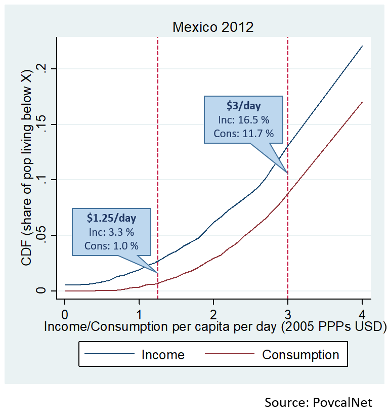
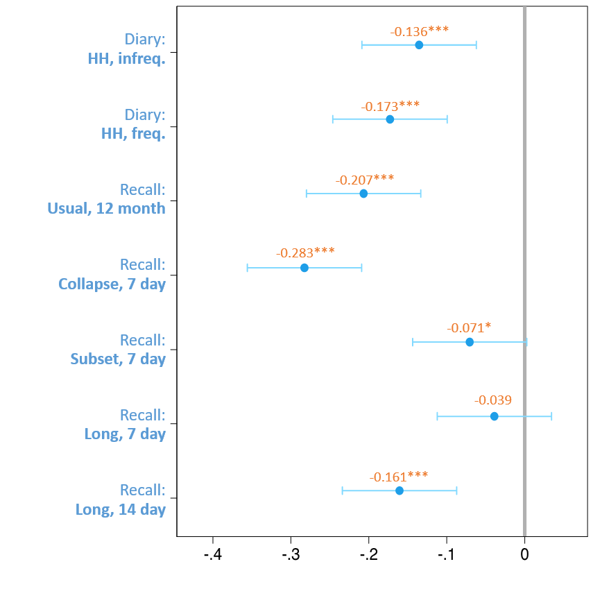
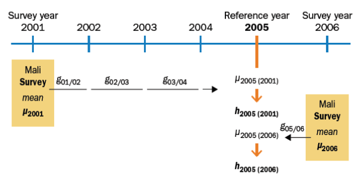
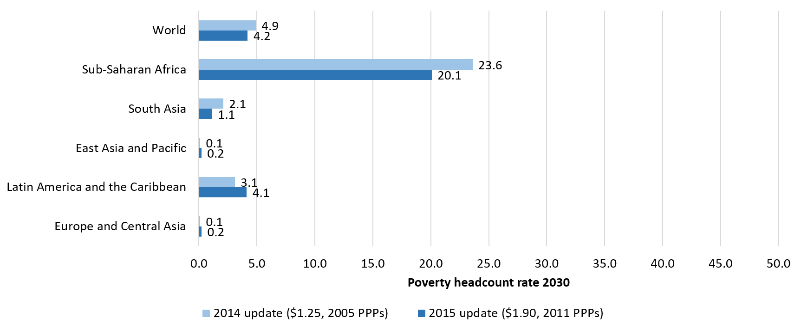

```{r setup, include=FALSE}
options(htmltools.dir.version = FALSE)
```

```{r xaringan-themer, include = FALSE}
library(xaringanthemer)
#mono_light(base_color = "#00ADE4")
mono_light(base_color = "#23395b")
#mono_light()
```

## Measuring Global Poverty: Basic Approach followed by the World Bank

Focus tends to be on the international poverty line, but ... 
--

There are two main ingredients,
1. Indicator of wellbeing (income or consumption)

2. Selection of poverty line, expresses in common currency

--
- These ingredients are aggregated to a summary of index for a _common_ year
  - Global headcount of extreme poverty in 2012 (Ferreira et al., 2015)

- Key Assumptions 
  - Measure of wellbeing comparable across countries and over time
  - Common poverty line is comparable across countries and over time. 

---

## National household surveys – foundation of the global poverty estimate

- NSOs collect household survey data for national poverty policies, not global poverty measurement. 
  
  - Typically reflecting country context, some countries collect data on consumption, expenditure, and/or income
  
  - Data is collected at the household level, differing adjustments for adult-equivalence (and/or economies of - scale)

- Some efforts to standardize

  - Some regional efforts to bring more uniformity of instrument

  - WB staff often ‘teach’ Deaton-Zaidi guidelines for consumption

  - PovCal requests data in per-capita terms

- But, important comparability issues remain…

---
## Comparability issue: Income and consumption


.pull-left[
- Income and consumption are different concepts (savings, volatility)

- Surveys often have zero incomes; seldom zero consumption.
  - Zeros exert significant influence on extreme poverty measures; more so as goal of eliminating poverty nears. 
  - Example: Poverty in Mexico 2012 (at $1.25/day, 2005 PPPs) was 3% based on income, 1% based on consumption

]

.pull-right[
```{r mexico,  fig.align='center',  echo=FALSE}

```
]
---
## Comparability issue: How consumption is measured differs (both between and within countries)

- Differences in questionnaire affect consumption:
  
  - Diaries vs. recall
  
  - Nonfood varies (some include rent, durables, and/or health; others do not) 
  
  - Count of pre-coded food items affects aggregate
  
  - Recall frame affects responses (e.g.,. Telescoping, “Great Indian Debate”)

- Many other important differences: Timing of fieldwork, Training, Supervision, Cleaning/editing rules; 
- etc. 

???
- INDIA EXAMPLE: Since 1950s - India used uniform 30-day recall period (URP), then switched recall frame - twice. In 2009, switched to “modified mixed reference period” (MMRP), short for some, long for others.
    - MMRP-based consumption gives poverty rate of 12 percent for 2011/12.
    - URP results in poverty rate of 21 percent for 2011/12 (used in WB estimate)
    - Difference of 109 million poor people in India’s and global estimates. 
---
## Comparability (cont.): Measurement methods differ

.pull-left[
```{r recall_period,  fig.align='left',  echo=FALSE}

```
]
.pull-right[
- Household consumption surveys vary widely (over time & countries)
- Beegle et al. (2012) provide experimental evidence on the effect
- Exact same instrument except increase recall period 
  - => 12% drop in avg consumption
  - => 8 point (%) increase in pov
- Same recall period, but long list collapsed to comprehensive groups 	=> 24% drop in avg consumption
	=> 32% drop in shared prosperity
- Research can inform questionnaire design & provide bridges across otherwise non-comparable data
]

---

## Complementary data needed to estimate poverty

Household surveys are necessary but not sufficient. We also need

- Purchasing power parity (PPP) indices

--

- Population (census) data

--

- Inflation and national accounts growth (consumption or GDP)

???
PPP: Make poverty lines and welfare comparable across countries

  - To estimate total number of poor
  - population frame for survey sample

  - Inflation data to keep measures of wellbeing in real terms
  - NA data to "line up" surveys into reference years
  
---
## Data Details: Consumption vectors scaled to common reference year

.pull-left[
- Most countries do not collect household surveys on annual basis, need to line up data to common point in time.
- If a survey is not available in the reference year, closest survey(s) are extrapolated to reference year using NAS growth rates.
  - GDP growth used in AFR, Private Consumption Expenditures used in other regions.

]
.pull-right[
```{r reference_year,  fig.align='left',  echo=FALSE}

```
]

---
## Global prospects for 2030

```{r forecast_2030,  fig.align='left',  echo=FALSE}

```

---
## Data and Assumptions

- Are the measures of economic wellbeing comparable?

- Is the value of the international poverty line ($1.90) comparable across countries?

- Is the value of the $1.90-line comparable with the previous international poverty line ($1.25)?

- And a couple of other interesting data questions….

---
class: center

