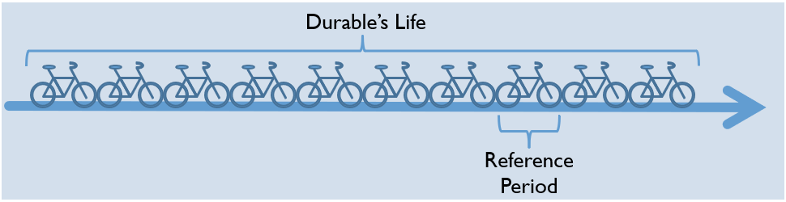

```{r setup, include=FALSE}
options(htmltools.dir.version = FALSE)
```

```{r xaringan-themer, include = FALSE}
library(xaringanthemer)
#mono_light(base_color = "#00ADE4")
mono_light()
```

# Outline

- Key References

- Definition:  What are durables?

- Why measure durables?

- How to measure durables?

  - Flow of services
  
  - User cost of durables
  
  - Data requirements

- Caveats

- Summary

---
class: center

# Key References

Deaton, A., and S. Zaidi. 2002. "Guidelines for constructing consumption aggregates for welfare analysis." _LSMS Working Paper_ No. 135, 

Amendola, N., and G. Vecchi. 2014. "Durable goods and poverty measurement." _World Bank Policy Research Working Paper_ 7105.

---
# Three definitions

- A durable good is a consumption good that can deliver _useful services to a consumer through repeated use over an extended period of time_ (Diewert, 2009)

--

- A consumer durable is a good that _may be used for purposes of consumption repeatedly or continuously over a period of a year or more_ (SNA, 200).

--

- Durable goods are consumer products that  
  - withstand wear and tear or decay
  - can be used over a relatively long period without being depleted or consumed

---
# Why measure durables?

- Long-lived goods (automobiles, appliances, furniture) have a positive and significant impact on living standards.
  - Time-saving (e.g. household appliances, transport means)
  - Entertainment (TV, DVD, etc) and communications (Phones)

- Poor households sometimes devote some expenditures to non-food items, including durable goods (Haughton and Khandker, 2009)

- Their inclusion ensures utility consistency.

- Failure to include durable goods may underestimate inequality (to be discussed later).

---

# How to measure durables

- NOT appropriate to use purchase prices of durables

- **Principle**: measure in monetary terms the flow of services that the houfehold from durable goods. 

.center[]

---

# How to measure durables


- The durables’ service flow exceeds the reference period of the welfare aggregate 

- The purchasing price reflects the value of the durable for its entire life

- Need to capture the value of the flow of the service during the reference period

---

# Theoretical framework

### Acquisition approach

If the good is purchased during the reference period, its entire value is attributed to the household welfare aggregate. 

### Rental equivalence

If a complete set of markets for the services of durables exists, we can use the market rental value of the goods.

### User cost
_The annual cost_ of holding the stock of each durable good. 

---
# The Annual Cost approach

We need to add the annual cost of holding the stock of each durable.

Based on a conceptual experiment in which the household buys the durable good at the beginning of each year, and then sell it at year’s end

This will depend on prices at the beginning and end of year, interest rates (opportunity cost) and the rate of depreciation

---
class: center


???

95 reports
Focus on user cost 

---
# User cost of durables

$$UC_d=S{_t}p{_t}(r_t - \pi_t + \delta)$$

$S_t$: Quantity of the durable

$p_t$: Price of the durable at the time of purchase

$r_t$: Nominal interest rate

$r_t$: Nominal interest rate

$\pi_t$: Inflation rate

$\delta$: Depreciation rate


$$UC=\sum_{d=1}^D{S_{td}p_{td}(r_t - \pi_t + \delta_d)}$$

$D$: Total number of durables considered

